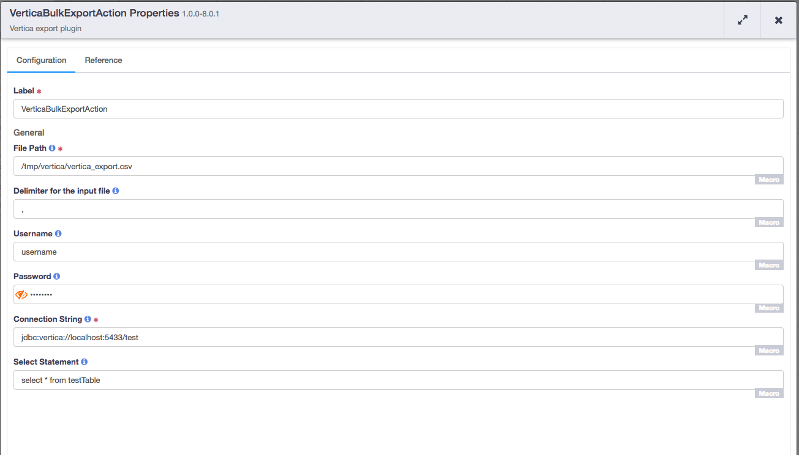

<a href="https://cdap-users.herokuapp.com/"></a> [](https://travis-ci.org/hydrator/vertica-bulk-export) [](https://opensource.org/licenses/Apache-2.0)  []() 

Vertica Bulk Export
===================

Vertica Bulk Export Action plugin gets executed after successful mapreduce or spark job. It executes select query on a vertica table and writes resultant in csv format in a provided file. 



Plugin Configuration
---------------------

| Configuration | Required | Default | Description |
| :------------ | :------: | :----- | :---------- |
| **Path** | **Y** | N/A | HDFS File path where exported data will be written. |
| **Delimiter** | **Y** | , | Delimiter in the output file. Values in each column is separated by this delimiter while writing to output file. |
| **Username** | **N** | N/A | User identity for connecting to the specified database. Required for databases that need authentication. Optional for databases that do not require authentication. |
| **Password** | **N** | N/A | Password to use to connect to the specified database. Required for databases that need authentication. Optional for databases that do not require authentication. |
| **Connection String** | **Y** | N/A | JDBC connection string including database name. |
| **selectStatement** | **Y** | N/A | Select command to select values from a vertica table |

Usage Notes
-----------

The plugin can be configured to connect to vertica table using jdbc, execute provided select query and write exported data to provided HDFS File. The parent directories for HDFS file does not need to be present, the plugin will create them if they do not exist. Plugin also has an option to choose column delimiter which defaults to comma. 
 
For running the vertica `select` query which can be found [here](https://my.vertica.com/docs/7.1.x/HTML/Content/Authoring/ConnectingToHPVertica/ClientJDBC/ExecutingQueriesThroughJDBC.htm.), the plugin uses vertica jdbc driver class and executes `select` query using that jdbc driver. The exported file will have all the column names as first row and remaining rows will be data. All the columns will be read as `String` and if there are `NULL` values in columns, plugin emits them as `null` string value.

Build
-----
To build this plugin:

```
   mvn clean package
```    

The build will create a .jar and .json file under the ``target`` directory.
These files can be used to deploy your plugins.

Deployment
----------
You can deploy your plugins using the CDAP CLI:

    > load artifact <target/vertica-bulk-load-<version>.jar config-file <target/vertica-bulk-load-<version>.json>

For example, if your artifact is named 'vertica-bulk-load-<version>':

    > load artifact target/vertica-bulk-load-<version>.jar config-file target/vertica-bulk-load-<version>.json
    
# Mailing Lists

CDAP User Group and Development Discussions:

* `cdap-user@googlegroups.com <https://groups.google.com/d/forum/cdap-user>`

The *cdap-user* mailing list is primarily for users using the product to develop
applications or building plugins for appplications. You can expect questions from 
users, release announcements, and any other discussions that we think will be helpful 
to the users.

# License and Trademarks

Copyright © 2017 Cask Data, Inc.

Licensed under the Apache License, Version 2.0 (the "License"); you may not use this file except
in compliance with the License. You may obtain a copy of the License at

http://www.apache.org/licenses/LICENSE-2.0

Unless required by applicable law or agreed to in writing, software distributed under the 
License is distributed on an "AS IS" BASIS, WITHOUT WARRANTIES OR CONDITIONS OF ANY KIND, 
either express or implied. See the License for the specific language governing permissions 
and limitations under the License.

Cask is a trademark of Cask Data, Inc. All rights reserved.

Apache, Apache HBase, and HBase are trademarks of The Apache Software Foundation. Used with
permission. No endorsement by The Apache Software Foundation is implied by the use of these marks.  
